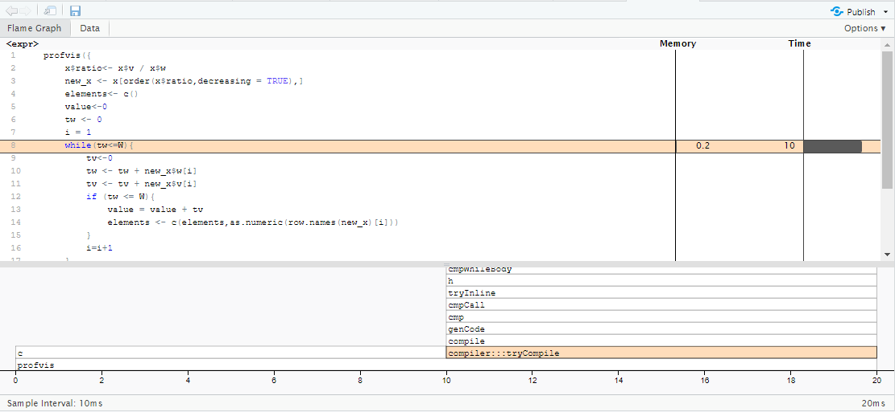

This vignette explains three functions of Knapsack package and gives examples on how to use them.
The 3 functions are,

1. Brute force algorithm
2. Dynamic algorithm
3. Greedy approximation algorithm

These functions takes a data.frame x with two variables v and w and returns the maximum knapsack value and which elements (rows in the data.frame).

```{r setup, include=FALSE} 
knitr::opts_chunk$set(warning = FALSE, message = FALSE) 
```

### Brute force algorithm

```{r}
brute_force_knapsack <- function(x,W, parallel=FALSE){
  stopifnot(is.data.frame(x),
            is.numeric(W),
            W>0,
            is.numeric(x$w),
            is.numeric(x$v),
            x$v>=0,
            x$w>=0)
  
  
  id=c(1:nrow(x))
  elements<-c()
  value<-0
  
  if(parallel==TRUE){
    cores <- parallel::detectCores()
    cores <-2
    
    cl <- parallel::makeCluster(cores, type = "PSOCK")
    parallel::clusterExport(cl, varlist=c("x","W","elements","value"), envir=environment())
    
    values<-parallel::parLapply(cl, 1:nrow(x), function(i, x,W) {
      
      for (a in 1:nrow(x)){
        y=as.matrix(combn(id,a))
        for (i in 1:ncol(y)){
          tv<-0
          tw<-0
          for (j in 1:nrow(y)){
            tw <- tw + x$w[y[j,i]]
            tv <- tv + x$v[y[j,i]]
          }
          if(tw<=W && tv>=value){
            value=max(value,tv)
            elements= y[,i]
          }
        }
      }
      output<-list(
        value = round(value),
        elements = elements)
      return(output)
      
    }, x, W)
    i=1
    a=values[[i]]
    val=a[[1]]
    elem=a[[2]]
    return(list("value"=val,"elements"=elem))
    parallel::stopCluster(cl)
    
  }
  
  else
  {
    brute_force<-function(x,W)
    {
      for (a in 1:nrow(x)){
        y=as.matrix(combn(id,a))
        for (i in 1:ncol(y)){
          tv<-0
          tw<-0
          for (j in 1:nrow(y)){
            tw <- tw + x$w[y[j,i]]
            tv <- tv + x$v[y[j,i]]
          }
          if(tw<=W && tv>=value){
            value=max(value,tv)
            elements= y[,i]
          }
        }
      }
      output<-list(
        value = round(value),
        elements = elements)
      return(output)
      
    }
    a = brute_force(x,W)
    val=a[[1]]
    elem=a[[2]]
    return(list("value"=val,"elements"=elem))
  }
}

```

#### Run time for 16 objects

```{r}
ptm <- proc.time()
n <- 16
knapsack_objects <- data.frame(
  w=sample(1:4000, size = n, replace = TRUE),
  v=runif(n = n, 0, 10000))
brute_force_knapsack(x = knapsack_objects[1:12,], W = 2000)
proc.time() - ptm
```

### Dynamic algorithm

```{r}
knapsack_dynamic <- function(x, W){
  stopifnot(is.data.frame(x) == TRUE)
  stopifnot(is.numeric(W) == TRUE)
  n <- nrow(x)
  w <- x[[1]]  #weights
  v <- x[[2]]  #values
  capacity <- W     #capacity of knapsack
  elem <- c()
  m <- matrix(0,nrow = n+1,ncol = capacity+1)
 
  #to return the max value 
  for (i in 2:n){
    for (j in 1:capacity){
      if (j > w[i]) 
        m[i, j] <- max(m[i-1, j-w[i]] + v[i], m[i-1, j])
      else 
        m[i,j] <- m[i-1, j]
    }
  }
  
  val <- m[i, j]
  value <- round(val)
  
  #to print the elements
  while(capacity>0 && n-1>0){
    if(m[n,capacity]!=m[n-1,capacity]){
      elem<-c(elem,n)
      capacity<-capacity-w[n]
      elements <- sort(elem)
    }
    n<-n-1
  }
  return(list("value"=value,"elements"=elements))
  
}
```

#### Run time for 500 objects

```{r}
ptm <- proc.time()
n <- 500
knapsack_objects <- data.frame(
  w=sample(1:4000, size = n, replace = TRUE),
  v=runif(n = n, 0, 10000))
knapsack_dynamic(x = knapsack_objects[1:12,], W = 2000)
proc.time() - ptm
```

### Greedy approximation algorithm

```{r}
greedy_knapsack <- function(x,W){
  stopifnot(is.data.frame(x),
            is.numeric(W),
            W>0,
            is.numeric(x$w),
            is.numeric(x$v),
            x$v>=0,
            x$w>=0)
  x$ratio<- x$v / x$w
  new_x <- x[order(x$ratio,decreasing = TRUE),]
  elements<- c()
  value<-0
  tw <- 0
  i = 1
  while(tw<=W){
    tv<-0
    tw <- tw + new_x$w[i]
    tv <- tv + new_x$v[i]
    if (tw <= W){
      value = value + tv
      elements <- c(elements,as.numeric(row.names(new_x)[i])) 
    }
    i=i+1
  }
  output <- list(
    value = round(value),
    elements = sort(elements, decreasing = FALSE)
  )
  return(output)
}
```

#### Run time for 1000000 objects

```{r}
ptm <- proc.time()
n <- 1000000
knapsack_objects <- data.frame(
  w=sample(1:4000, size = n, replace = TRUE),
  v=runif(n = n, 0, 10000))
greedy_knapsack(x = knapsack_objects[1:1200,], W = 2000)
proc.time() - ptm
```

### Profile your code and optimize your code

```
> install.packages("lineprof")
Warning in install.packages :
  package ‘lineprof’ is not available for this version of R
```
It is **not possible** to install "lineprof", we used "profvis" instead.

```{r, echo=TRUE, eval=FALSE, message=FALSE, results='asis'}
library(profvis)
profvis({
    x$ratio<- x$v / x$w
  new_x <- x[order(x$ratio,decreasing = TRUE),]
  elements<- c()
  value<-0
  tw <- 0
  i = 1
  while(tw<=W){
    tv<-0
    tw <- tw + new_x$w[i]
    tv <- tv + new_x$v[i]
    if (tw <= W){
      value = value + tv
      elements <- c(elements,as.numeric(row.names(new_x)[i])) 
    }
    i=i+1
  }
  output <- list(
    value = round(value),
    elements = sort(elements, decreasing = FALSE)
  )
  return(output)
})
```

```{r echo=FALSE}

```

The while loop is the most time consuming, taking 10ms.
There are several techniques for improving code performance.
While loops are always time-consuming in R, Hadly Wickham lists some techniques in the chapter. For example, to vectorize or parallelize the code (which we did to speed up the Brute force search).

### (*) Parallelize brute force search


```{r}
system.time(brute_force_knapsack(x = knapsack_objects[1:16,], W = 3500))

```

If `parallel=TRUE`:

```{r}
system.time(brute_force_knapsack(x = knapsack_objects[1:16,], W = 3500,parallel = TRUE))
```

The user time better when compared to non-parallelized case, but the elapsed time is longer.

### Examples

#### For brute force method

```{r}
#brute_force_knapsack(x = knapsack_objects[1:8,], W = 3500)
#brute_force_knapsack(x = knapsack_objects[1:12,], W = 2000)
```

#### For dynamic approach

```{r}
#knapsack_dynamic(x = knapsack_objects[1:8,], W = 3500)
#knapsack_dynamic(x = knapsack_objects[1:12,], W = 2000)
```

#### For greedy approach
```{r}
#greedy_knapsack(x = knapsack_objects[1:800,], W = 3500)
#greedy_knapsack(x = knapsack_objects[1:1200,], W = 2000)
```


```{r echo=FALSE}
#library(tictoc)
#tic()   # refer https://www.r-bloggers.com/5-ways-to-measure-running-time-of-r-code/
#knapsack_dynamic(x = knapsack_objects[1:8,], W = 2000)
#toc()
```


### See also

1. "Description of Knapsack problem"
([via](https://en.wikipedia.org/wiki/Knapsack_problem))

2. "Pseudocode to implement dynamic algorithm"
([via](https://en.wikipedia.org/wiki/Knapsack_problem#0.2F1_knapsack_problem))

3. "To implement greedy approach"
([via](https://en.wikipedia.org/wiki/Knapsack_problem#Greedy_approximation_algorithm))

4. "To measure the run time of code chunk"
([via](https://www.r-bloggers.com/5-ways-to-measure-running-time-of-r-code/))